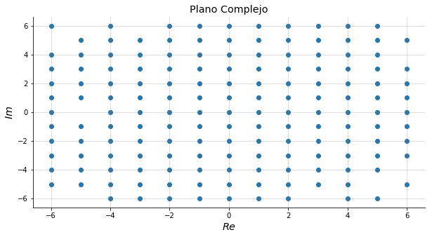
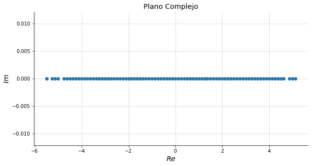

#### Notas 1.1

Consideremos de nuevo los **enteros gaussianos **

$$ \mathbb{Z}[i] = \{ a+bi \mid a,b \in \mathbb{Z} \}​$$

Este es el subanillo _más pequeño_ de $\mathbb{C}$ que contiene a $i$. 

Su gráfica es forma una especie de "_reja_".

Si cambiamos el valor de $\alpha$ por ejemplo, $\alpha = 1/2$, la gráfica es

#### Cuaterniones

Este es un ejemplo de un **anillo no conmutativo con división**. 

Reglas: $i^2 = j^2 = k^2 = ijk = -1$, y $ i \rightarrow  j \rightarrow k \curvearrowright$.

División: si $\gamma = \alpha_0 + \alpha_1 i + \alpha_2 j + \alpha_3 k$, entonces $\gamma^{-1} = \frac{\alpha_0}{\beta} - \frac{\alpha_1}{\beta}i - \frac{\alpha_2}{\beta} j - \frac{\alpha_3}{\beta} k$, con $\beta = \alpha_0^2 +  \alpha_1^2 +  \alpha_2^3+ \alpha_3^2$.

#### FACTS

1. Si $0 = 1$, entonces $R = \{0\}$.
2. $a0 = 0$; $a(-b) = (-a)b = - (ab)$; $(-a)(-b) = -(ab)

#### Definiciones

